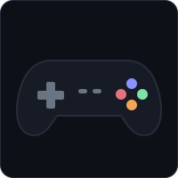
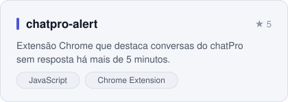
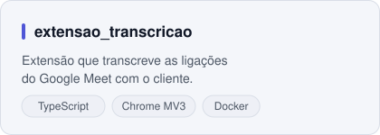
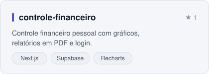
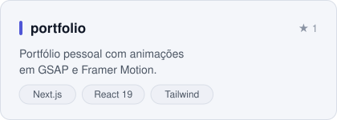

  <picture>
    <source media="(prefers-color-scheme: dark)" srcset="assets/banner-dark.svg">
    
  </picture>

  

  

  

  

<h3 align="center">Sobre mim</h3>

Sou `Software Engineer` na `chatPro`, em Goiânia, plataforma de atendimento e vendas pelo WhatsApp. Crio as ferramentas que deixam o time de suporte e de vendas mais rápido: `extensões de navegador`, `automações de envio`, `transcrição de reuniões` e, agora, `agentes de IA` que conversam com o lead.

Fora da chatPro, toco a `Vortexi`, onde faço sites e sistemas sob medida para empresas, e desenvolvo produtos próprios com `Next.js, React, TypeScript e Supabase`.
Gosto de pegar um problema real da operação, entender o fluxo de quem usa e entregar a solução inteira: interface, integração, testes e deploy. Em paralelo, sigo na faculdade, estudando segurança da informação e desenvolvimento mobile.

 

  

<h3 align="center">Além do código</h3>

⬛ Games são meu descanso, principalmente The Last of Us 
⬜ Empreender: toco a Vortexi em paralelo ao trabalho 
⬛ Curioso por IA, agentes e tudo que automatiza trabalho repetitivo 
⬜ Aprendo construindo: quase todo projeto aqui começou como teste 
⬛ Sempre atrás da próxima coisa pra aprender e colocar em prática 

  
  &nbsp;
  
  &nbsp;
  

 

  <h3 align="center">
    
    GitHub Stats</h3>
  

  <h3 align="center">
    
    Tech Stacks</h3>

  

  <a href="https://skillicons.dev">
      
      
      
  </a>
  

  <h3 align="center">
    
    Projetos em destaque</h3>

<table>
  <tr>
    <td>
      <a href="https://github.com/WeudenReis/chatpro-alert">
        <picture>
          <source media="(prefers-color-scheme: dark)" srcset="assets/card-chatpro-alert-dark.svg">
          
        </picture>
      </a>
    </td>
    <td>
      <a href="https://github.com/WeudenReis/extensao_transcricao">
        <picture>
          <source media="(prefers-color-scheme: dark)" srcset="assets/card-transcricao-dark.svg">
          
        </picture>
      </a>
    </td>
  </tr>
  <tr>
    <td>
      <a href="https://github.com/WeudenReis/controle-financeiro">
        <picture>
          <source media="(prefers-color-scheme: dark)" srcset="assets/card-controle-financeiro-dark.svg">
          
        </picture>
      </a>
    </td>
    <td>
      <a href="https://github.com/WeudenReis/portfolio">
        <picture>
          <source media="(prefers-color-scheme: dark)" srcset="assets/card-portfolio-dark.svg">
          
        </picture>
      </a>
    </td>
  </tr>
</table>

<b>O que eu faço, em detalhe</b>

 

**Automação de atendimento na chatPro**
- **chatpro-alert**: extensão Chrome que destaca as conversas sem resposta há mais de 5 minutos, para nenhum cliente ficar esperando.
- **Extensão de disparos**: envio em massa de imagem, PDF e texto direto de dentro do chatPro, com ritmo controlado entre mensagens.
- **Extensão de transcrição**: transcreve as ligações do Google Meet com o cliente. Em desenvolvimento: criar o link da reunião, mandar para o cliente e gravar tudo pelo próprio chatPro.
- **Tour do teste grátis**: onboarding guiado dentro do chatPro, que leva o novo usuário pelos primeiros passos da ferramenta.
- **IA SDR**: MVP de um agente de pré-venda que qualifica leads pelo WhatsApp.
- **Quadro de suporte interno**: um Kanban no estilo Trello feito sob medida para o time.

**Sites e sistemas pela Vortexi**
- Site institucional da [Vortexi](https://vortexi.com.br), com animações e cases reais.
- Integração com o Notion via API para organizar a operação.

**Produtos próprios**
- **Sistema Vitrine**: cria landing pages, acompanha o tráfego pago e centraliza os leads num só lugar.
- **Controle financeiro** e **controle de vendas**: painéis com gráficos, relatórios em PDF e login.
- MVPs de aplicativos para apresentar ideias a clientes e sócios.

**Faculdade**
- Atividades de segurança da informação em Python.
- App Android de cálculo de IMC, no Android Studio.

Boa parte desses projetos é privada, por ser de empresa ou de cliente.

<b>Linha do tempo</b>

 

| Quando | O que rolou |
| --- | --- |
| **Mar 2025** | Criei a conta no GitHub |
| **Jan 2026** | Controle financeiro pessoal em Next.js e Supabase |
| **Fev 2026** | Sistema de controle de vendas |
| **Mar 2026** | Quadro de suporte interno e meu portfólio |
| **Mai 2026** | chatpro-alert, minha primeira extensão para a chatPro |
| **Jun 2026** | Site e integração com Notion da Vortexi |
| **Jul 2026** | Sistema Vitrine: landing pages, tráfego pago e leads |
| **Ago 2026** | Extensão de transcrição de reuniões do Meet |
| **Set 2026** | Extensão de disparos, tour do teste grátis e o MVP da IA SDR |

